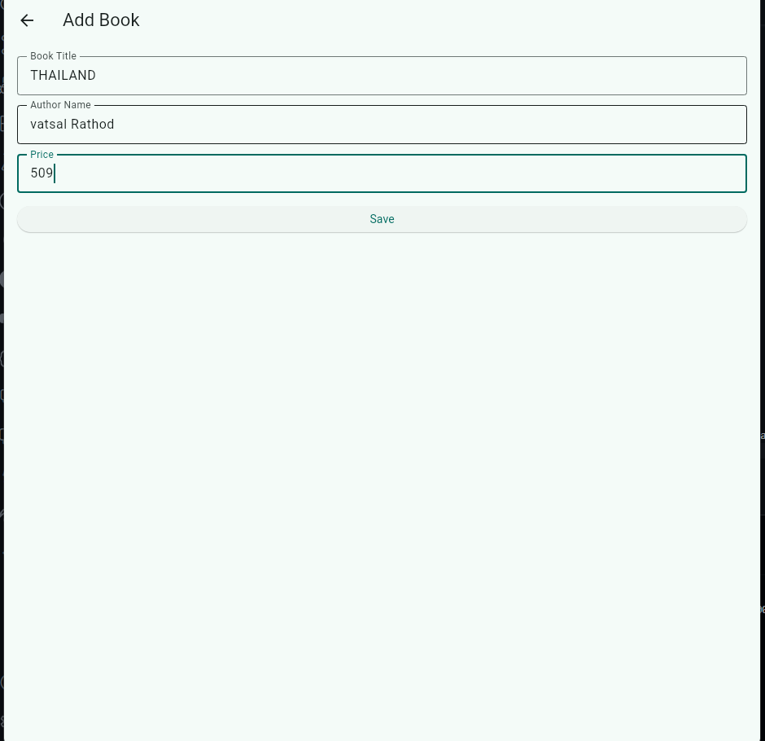
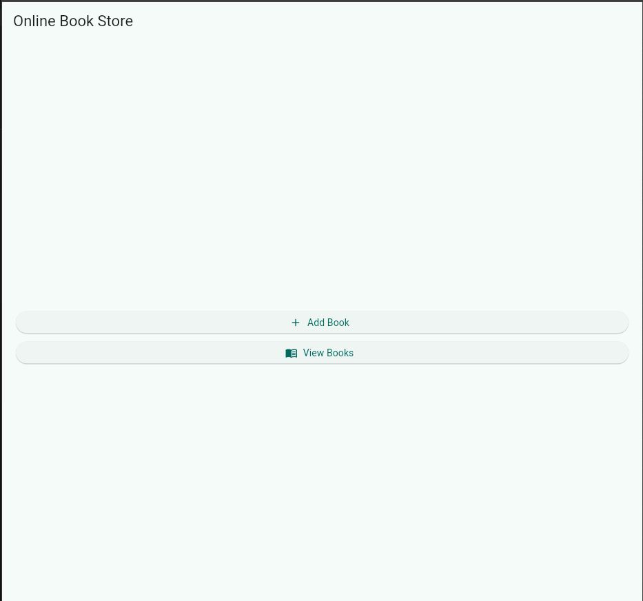
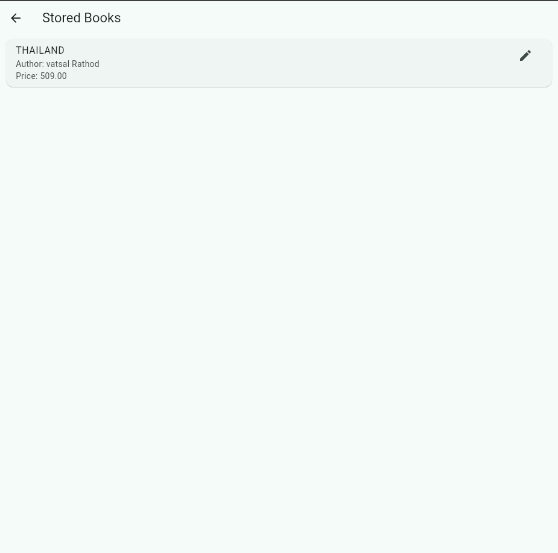

# Online Book Store Application

A basic Flutter activity app that demonstrates local data handling with Hive. The application supports adding books, viewing saved books, and updating existing book details without using any external server.

## App Purpose

The purpose of this activity is to demonstrate how Flutter can:
- store local data,
- retrieve local data,
- update local data.

## Features

- Add Book: Save book title, author name, and price.
- View Book List: Display all books stored in local database.
- Update Book Details: Edit title, author, or price of an existing book.
- Local Storage: Persist all records using Hive.

## Screens

- Home Screen: Buttons for `Add Book` and `View Books`.
- Add Book Screen: Input fields for title, author, and price with save action.
- Book List Screen: Stored records with an edit button for each book.

## Application Workflow

1. Open the app.
2. Go to `Add Book`.
3. Enter title, author name, and price.
4. Save data to Hive local storage.
5. Go to `View Books` to see stored records.
6. Tap `Edit` for any record.
7. Update and save the edited details.

## Technologies Used

- Flutter
- Dart
- Hive
- GitHub

## Project Structure

```text
onlinbookstore/
|-- lib/
|   |-- main.dart
|   |-- models/
|   |   |-- book_model.dart
|   |-- screens/
|       |-- home_screen.dart
|       |-- add_book.dart
|       |-- book_list.dart
|-- documentation/
|   |-- Online_Book_Store_Report.pdf
|-- screenshots/
|   |-- home-screen.png
|   |-- add-book-screen.png
|   |-- book-list-screen.png
|-- README.md
|-- pubspec.yaml
```

## Documentation

- Project report PDF: [Online_Book_Store_Report.pdf](documentation/Online_Book_Store_Report.pdf)

## Screenshots

### Home Screen



### Add Book Screen



### Book List Screen



## Run Locally

1. Get dependencies.

```bash
flutter pub get
```

2. Run on Chrome (quickest for this setup).

```bash
flutter run -d chrome
```

3. Run on Windows desktop (requires Visual Studio C++ workload).

```bash
flutter run -d windows
```

## Conclusion

The Online Book Store Application successfully demonstrates local CRUD operations in Flutter using Hive. This activity shows how mobile apps can manage data effectively without online databases.
